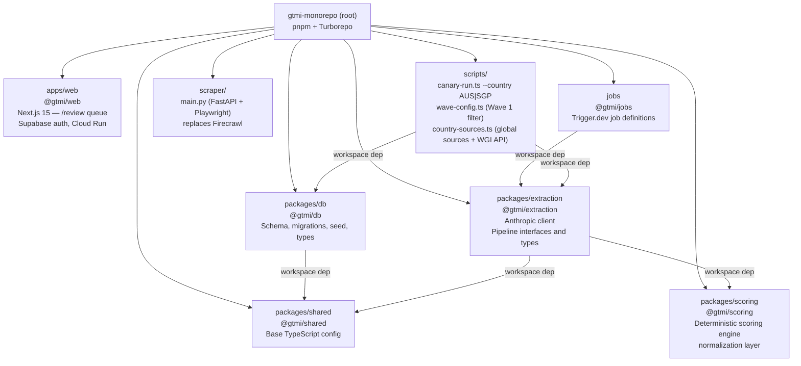
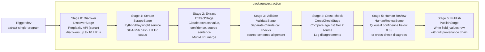
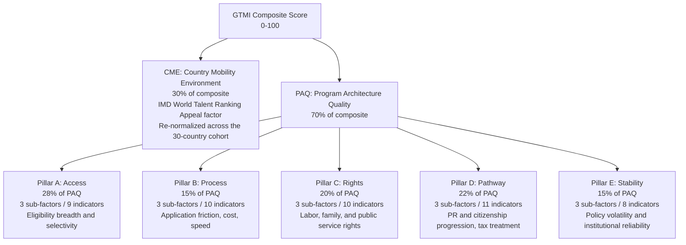

# GTMI Architecture Overview

> This document reflects what is implemented on `main` as of Session 10 — **Phase 2 closed (tag `phase-2-complete`, 2026-04-27)**. AUS and SGP canaries scored deterministically, both flagged `phase2Placeholder: true`. Review UI deployed to Cloud Run behind Supabase magic-link auth. For the full product specification see [docs/BRIEF.md](BRIEF.md). For the scoring methodology see [docs/METHODOLOGY.md](METHODOLOGY.md).

> **Last updated:** Session 10 — 27 Apr 2026. Phase 2 close-out shipped: field-aware content windowing, Wave 2 enabled (48-field coverage), currency preservation in provenance, batch extraction with extraction cache, scrape cache + guards, ADR-008 deferring Wayback to Phase 5, /review reject flow patched, AUS+SGP scored, Tier-1 URLs refreshed (ATO added for AUS tax fields), 6 LLM_MISS prompts tuned.

## 1. Overview

The Global Talent Mobility Index (GTMI) is a composite indicator platform that benchmarks talent-based premium mobility programs across 30 countries. It combines a 30% Country Mobility Environment (CME) score derived from IMD's published Appeal factor with a 70% Program Architecture Quality (PAQ) score built from 48 indicators across 5 pillars and 15 sub-factors, all sourced exclusively from government documents. Every published value is traceable to an exact sentence in a government source, with scrape timestamp, content hash, character offsets, and extraction model recorded. The index re-scrapes all Tier 1 sources weekly and surfaces policy changes as they occur.

## 2. Monorepo Layout

The repository is a pnpm workspace orchestrated with Turborepo. Six workspace packages are active.

| Workspace             | Responsibility                                                                                                                                                                                                                                                                                                                                                                                                                                                                                                                                                                                                                                                                                                                                                                                                                                                                                                                                                                                                                                                                                                                                                       |
| --------------------- | -------------------------------------------------------------------------------------------------------------------------------------------------------------------------------------------------------------------------------------------------------------------------------------------------------------------------------------------------------------------------------------------------------------------------------------------------------------------------------------------------------------------------------------------------------------------------------------------------------------------------------------------------------------------------------------------------------------------------------------------------------------------------------------------------------------------------------------------------------------------------------------------------------------------------------------------------------------------------------------------------------------------------------------------------------------------------------------------------------------------------------------------------------------------- |
| `apps/web`            | Next.js 15 dashboard. Public landing page plus an authenticated `/review` queue (Supabase magic-link auth, route protection in `middleware.ts`). Pending and recently-reviewed tabs grouped by country/program; detail page surfaces source sentence + extraction/validation confidence; approve flow re-normalises on edit; reject flow patched to read row id from FormData (closure binding was unreliable across Next.js minor versions). Deployed to Cloud Run via `Dockerfile` + `cloudbuild.yaml` + `deploy.cmd`.                                                                                                                                                                                                                                                                                                                                                                                                                                                                                                                                                                                                                                             |
| `packages/db`         | Drizzle ORM schema and migrations for Supabase. Migrations: `00001_core_schema`, `00002_add_news_sources`, `00003_update_imd_appeal_scores`, `00004_extraction_caches` (scrape + extraction caches). Seed scripts for all reference data, methodology v1 weights, and unit tests.                                                                                                                                                                                                                                                                                                                                                                                                                                                                                                                                                                                                                                                                                                                                                                                                                                                                                    |
| `packages/extraction` | Client factories for Anthropic. Typed interfaces for all 7 pipeline stages. Shared types for extraction inputs, outputs, and provenance records. Batch extraction (`executeBatch` / `executeAllFields`) extracts all `ACTIVE_FIELD_CODES` from a single scrape in one LLM call (8K max-tokens, JSON array); merges across URLs by highest confidence per field; early-exits when every field reaches confidence ≥ 0.9. Inter-batch delay 30s. Field-aware content windowing (`utils/window.ts`) replaces the head-slice. Extraction cache (`extraction_cache` table) keyed on `sha256(contentHash + fieldKey + promptHash + WINDOW_VERSION)`; cache hits skip the LLM call. Extraction system prompt enforces strict per-field-type output format and treats bullet lists, condition blocks, numbered requirement lists, and table rows as explicit statements. Rate-limit retry: 3× with exponential back-off. Currency utility (`utils/currency.ts`) preserves ISO 4217 code in `provenance.valueCurrency` before numeric normalization.                                                                                                                           |
| `packages/scoring`    | Deterministic scoring engine (`engine.ts`, `score.ts`, `normalize.ts`). `normalizeRawValue` normalization layer (`normalize-raw.ts`). 99 tests; vitest wired into CI.                                                                                                                                                                                                                                                                                                                                                                                                                                                                                                                                                                                                                                                                                                                                                                                                                                                                                                                                                                                                |
| `packages/shared`     | Base tsconfig extended by all other packages. No runtime code.                                                                                                                                                                                                                                                                                                                                                                                                                                                                                                                                                                                                                                                                                                                                                                                                                                                                                                                                                                                                                                                                                                       |
| `jobs`                | Trigger.dev v3 job definitions. `extract-single-program` runs the full 7-stage pipeline end-to-end with a tier-2 fallback batch for missing fields, mirroring canary behaviour.                                                                                                                                                                                                                                                                                                                                                                                                                                                                                                                                                                                                                                                                                                                                                                                                                                                                                                                                                                                      |
| `scraper`             | Python FastAPI + Playwright microservice. Replaces Firecrawl. `main.py` exposes `POST /scrape` and `GET /health`. Start with `uvicorn main:app --host 0.0.0.0 --port 8765` for local; deploy target is Cloud Run. `SCRAPER_URL` env var (default `http://localhost:8765`).                                                                                                                                                                                                                                                                                                                                                                                                                                                                                                                                                                                                                                                                                                                                                                                                                                                                                           |
| `scripts`             | `canary-run.ts` — full 7-stage pipeline runner; accepts `--country AUS\|SGP\|CAN\|GBR`; pre-fetches WGI score; bypasses LLM for E.3.2; cross-check hardcoded to `not_checked`; tier-2 fallback batch for missing fields. `wave-config.ts` — exports `WAVE_1_FIELD_CODES` (27), `WAVE_2_FIELD_CODES` (21), and `ACTIVE_FIELD_CODES` (canonical export; controlled by `WAVE_2_ENABLED`, currently `true`). `country-sources.ts` — `COUNTRY_LEVEL_SOURCES` registry (4 global sources + ATO for AUS tax fields), `getCountryLevelSources(fieldKey)`, `fetchWgiScore(iso3)`, `ISO3_TO_ISO2` mapping. `run-paq-score.ts --country AUS\|SGP` writes scores rows tagged `phase2Placeholder: true`. `compute-normalization-params.ts` derives p10/p90 calibration once ≥5 programs are scored. `verify-provenance.ts` — read-only check that every `field_values` row has a complete `ProvenanceRecord` JSONB; CI exit-code semantics. `diag-empty-fields.ts` — TRUNCATION / LLM_MISS / ABSENT classifier. `sync-prompts-from-seed.ts`, `purge-orphan-pending.ts`, `backfill-monetary-normalization.ts`, `audit-phase2.ts`, `audit-scrape-cache.ts`, `purge-bad-scrapes.ts`. |

## 3. Data Flow: 7-Stage Extraction Pipeline

The extraction pipeline is defined as TypeScript interfaces in `packages/extraction/src/types/pipeline.ts`. All 7 stage implementations are committed to `packages/extraction/src/stages/`. The Trigger.dev job `extract-single-program` runs the full pipeline end-to-end.

Stage 0 uses the **Perplexity API** (`sonar` model, `PERPLEXITY_API_KEY`). Stage 1 uses the **Python/Playwright scraper service** (`SCRAPER_URL`). Stages 2–4 and bulk summaries use `claude-sonnet-4-6`. Four Claude model constants are exported from `packages/extraction/src/clients/anthropic.ts`: `MODEL_EXTRACTION` (Stage 2), `MODEL_VALIDATION` (Stage 3), `MODEL_CROSSCHECK` (Stage 4), and `MODEL_SUMMARY`. `MODEL_DISCOVERY` is also defined but unused by `discover.ts`. Each constant is independently updatable.

**Wave configuration:** `scripts/wave-config.ts` exports `ACTIVE_FIELD_CODES = WAVE_1_FIELD_CODES ∪ (WAVE_2_ENABLED ? WAVE_2_FIELD_CODES : [])`. `WAVE_2_ENABLED = true` (Phase-2-close-out default) → all 48 methodology fields. `WAVE_2_ENABLED = false` reverts to the 27-field Wave 1 scope. All consumers — `canary-run.ts`, `extract-single-program.ts`, `run-paq-score.ts`, `diag-empty-fields.ts` — import `ACTIVE_FIELD_CODES` so a single flag flip changes scope everywhere. Note: Trigger.dev picks up `ACTIVE_FIELD_CODES` at runtime, so production scope changes the moment Trigger.dev redeploys. Staged rollouts to production must flip the flag to `false` before deploy.

**Field-aware content windowing:** `packages/extraction/src/utils/window.ts` exposes `selectContentWindow(content, fields, maxChars)`. The batch extraction path scores 2K-char chunks (200-char overlap) by per-field keyword match against `field_definitions.label`, then greedily fills a 30K budget while preserving a 1500-char baseline prefix and 800-char baseline suffix. Replaces the previous `content.slice(0, 30000)` truncation. Cache key in `extract.ts` includes a `WINDOW_VERSION` constant so windowing changes invalidate stale cache rows cleanly. When no field labels are passed (single-field legacy path), windowing falls back to head-slice — guaranteed never worse than pre-windowing behaviour. The redundant 30K cap on `scrape.ts` was removed.

**Batch extraction + caching:** `executeBatch` extracts all fields for a single scrape in one LLM call (8K max-tokens, JSON array response). `executeAllFields` iterates batches across URLs and merges by highest confidence per field, with a 30s inter-batch delay and an early-exit once every field reaches confidence ≥ 0.9. The `extraction_cache` table (migration `00004`) memoizes results keyed by `sha256(contentHash + fieldKey + promptHash + WINDOW_VERSION)`; cache hits skip the LLM entirely. The `scrape_cache` table memoizes scrape responses for 24h.

**Currency preservation:** `utils/currency.ts` (`detectCurrency()`) recognises 19 ISO 4217 codes and common symbols. `publish.ts` strips the prefix before normalization and writes the code into `provenance.valueCurrency` — no schema change required. `scripts/backfill-monetary-normalization.ts` re-normalizes pending-review rows that were null because the prefix was not stripped pre-fix.

**Two-phase discovery:** Before Stage 0 runs, `scripts/country-sources.ts` country-level sources are loaded and scraped once per country (Phase 1). Stage 0 then discovers program-specific URLs (Phase 2). Per-field in Stage 2, country-level scrapes supplement program-level scrapes. Stage 4 cross-check selects the Tier 2 URL by keyword match against the field label, falling back to global sources from `scripts/country-sources.ts` if no program-level Tier 2 URL matches.

## 4. Tech Stack

| Layer         | Technology                                                                                                                      | Notes                                                                                                                                                                                                                                                                                                                                                                                                                                                                        |
| ------------- | ------------------------------------------------------------------------------------------------------------------------------- | ---------------------------------------------------------------------------------------------------------------------------------------------------------------------------------------------------------------------------------------------------------------------------------------------------------------------------------------------------------------------------------------------------------------------------------------------------------------------------- |
| Frontend      | Next.js 15, React 19, Tailwind CSS v3, shadcn/ui, Recharts                                                                      | App Router, TypeScript strict mode. `/review` route is auth-gated.                                                                                                                                                                                                                                                                                                                                                                                                           |
| Auth          | Supabase Auth (magic link)                                                                                                      | Middleware enforces auth on `/review`; `NEXT_PUBLIC_APP_URL` carries the canonical origin so callback redirects work behind Cloud Run.                                                                                                                                                                                                                                                                                                                                       |
| Database      | Supabase (Postgres 15), Drizzle ORM                                                                                             | RLS on all 13 tables from day one. Adds `scrape_cache` (24h TTL) and `extraction_cache` (keyed by content hash + field key + prompt hash + window version) in migration `00004`.                                                                                                                                                                                                                                                                                             |
| URL Discovery | Perplexity API (`sonar`)                                                                                                        | `PERPLEXITY_API_KEY`; live web search for up to 10 URLs per program                                                                                                                                                                                                                                                                                                                                                                                                          |
| Scraping      | Python/Playwright microservice (`scraper/`)                                                                                     | FastAPI + Playwright; start with `uvicorn main:app --host 0.0.0.0 --port 8765` for local; deploy target is Cloud Run; `SCRAPER_URL` env var. Scrape guards reject empty / HTML-error / anti-bot responses before they enter extraction.                                                                                                                                                                                                                                      |
| Extraction    | Anthropic API                                                                                                                   | `claude-sonnet-4-6` extracts and validates. Batch extraction across all `ACTIVE_FIELD_CODES` per URL (8K max-tokens, JSON array); 30s inter-batch delay; early-exit at confidence ≥ 0.9 across every field. Field-aware content window keeps relevance-scored 2K chunks within a 30K budget. Rate-limit retry: 3× with exponential back-off. Currency code preserved in provenance before normalization.                                                                     |
| Jobs          | Trigger.dev v3                                                                                                                  | `extract-single-program` runs full pipeline; `maxDuration: 900`; tier-2 fallback batch matches canary behaviour.                                                                                                                                                                                                                                                                                                                                                             |
| Email         | Resend                                                                                                                          | Policy change alerts (Phase 5)                                                                                                                                                                                                                                                                                                                                                                                                                                               |
| Archival      | Wayback Machine Save Page Now API                                                                                               | Deferred to Phase 5 per [ADR-008](decisions/008-defer-wayback-archival-to-phase-5.md)                                                                                                                                                                                                                                                                                                                                                                                        |
| Tooling       | pnpm workspaces, Turborepo, TypeScript strict, Vitest                                                                           | Strict mode enforced across all packages; vitest tests run in CI. a11y assertions via `vitest-axe`.                                                                                                                                                                                                                                                                                                                                                                          |
| Web deps      | next-themes, recharts, framer-motion, @vercel/og, remark + remark-html, pino, lucide-react, vendored flag SVGs (flag-icons MIT) | Phase 4 stack additions. `next-themes` for the dark-mode toggle. `recharts` for the pillar radar. `framer-motion` for FLIP row reorder (with `useReducedMotion()`). `@vercel/og` for runtime 1200×630 OG image generation on Cloud Run. `remark`+`remark-html` for markdown content rendering. `pino` for Cloud-Logging-shaped JSON server logs. `lucide-react` pinned to `^0.460.x` for shadcn compatibility. 30 country flag SVGs vendored under `apps/web/public/flags/`. |
| Deployment    | Cloud Run (web + scraper), Supabase cloud, Trigger.dev cloud                                                                    | Web app `apps/web` builds via `Dockerfile` + `cloudbuild.yaml` and deploys to Cloud Run. Scraper service `scraper/` deploys to Cloud Run. Vercel not in use.                                                                                                                                                                                                                                                                                                                 |

## 5. Methodology Scoring Model

See [docs/METHODOLOGY.md](METHODOLOGY.md) for the authoritative breakdown of sub-factor weights, indicator weights, normalization choices, and rubrics. The diagram below reflects the top-level composite structure as encoded in `packages/db/src/seed/methodology-v1.ts`.

All weights sum to 1.0 at every level. The methodology version is stored in the `methodology_versions` table and carried on every `scores` and `field_values` row. Scores are not recomputed retroactively when the methodology changes; each scoring run carries its version ID.

## 6. Provenance and Data Integrity

### Source tiers

Indicators in Pillars A through D, and in E.1 and E.2, must be populated exclusively from Tier 1 sources. Pillar E.3 uses external indices by design and discloses this on the methodology page.

| Tier   | Sources                                                                             | Use                                                                 |
| ------ | ----------------------------------------------------------------------------------- | ------------------------------------------------------------------- |
| Tier 1 | Immigration authority, tax authority, ministry, official gazette, statistics bureau | Primary extraction for all PAQ indicators (Pillars A-D and E.1-E.2) |
| Tier 2 | Law firm commentary (Fragomen, KPMG, Envoy, Baker McKenzie)                         | Cross-check and program narrative context only                      |
| Tier 3 | IMI Daily, Henley newsroom, Expatica, Nomad Gate, general news                      | Policy change early-warning signals only                            |

### Fail-loud posture

The seed script (`packages/db/src/seed/index.ts`) throws immediately on any malformed row. There are no silent skips, no `skip_empty_lines` options, and no default values substituted for missing required fields. Clean CSVs are enforced at the source by `scripts/convert-assets.ts`, which asserts exact row counts after stripping trailing blank lines before writing.

Missing indicator data is not imputed. An absent indicator is excluded from its sub-factor calculation, and a square-root penalty is applied at the sub-factor level. Programs below 70% data coverage on any pillar are flagged "insufficient disclosure" and withheld from the public ranking.

## 7. Current State

### Implemented on main (Phase 2 complete — tag `phase-2-complete`)

- **Schema**: 13 tables via Drizzle ORM. 12 core tables per [docs/BRIEF.md](BRIEF.md) plus `newsSources` (migration `00002`). Migration `00004` adds `scrape_cache` (24h TTL, deduped by URL hash) and `extraction_cache` (keyed by content hash + field key + prompt hash + window version). RLS policies on all tables; V1 uses a placeholder `authenticated` role (see [docs/decisions/001-rls-v1-placeholder-auth.md](decisions/001-rls-v1-placeholder-auth.md)).
- **Seed data**: 30 countries, 85 programs, 85 Tier 1 sources, 10 Tier 3 news sources, and 48 `field_definitions` rows with weights, normalization functions, directions, and `extraction_prompt_md` fully populated. `sync-prompts-from-seed.ts` pushes seed prompt updates into the live `field_definitions` table.
- **Methodology v1**: Pillar, sub-factor, and indicator weights encoded in `packages/db/src/seed/methodology-v1.ts` and unit-tested in `packages/db/src/seed/__tests__/methodology-v1.test.ts`. Weights sum to 1.0 at every level; indicator count is exactly 48.
- **CI pipeline**: GitHub Actions runs lint, typecheck, vitest, and migration dry-run on every push/PR to `main`.
- **Trigger.dev job**: `extract-single-program` connected to project `proj_wqkutxouuojvjdzsqopp`. `maxDuration: 900`. Tier-2 fallback batch matches canary behaviour.
- **Pipeline stage implementations**: All 7 stages committed to `packages/extraction/src/stages/`. `discover.ts` calls Perplexity API (`sonar`, `PERPLEXITY_API_KEY`) and verifies each URL with a HEAD request (404/410 discarded). `scrape.ts` calls the Python/Playwright service at `SCRAPER_URL`; scrape cache deduplicates by URL hash with a 24h TTL; scrape guards reject empty/HTML-error/anti-bot bodies. `extract.ts` runs `executeAllFields` — batch extraction of every `ACTIVE_FIELD_CODE` from one scrape in a single LLM call (8K max-tokens, JSON array), merged across URLs by highest confidence per field, with an early-exit when every field reaches confidence ≥ 0.9. Field-aware content window (`utils/window.ts`) selects relevance-scored 2K chunks (200-char overlap) within a 30K budget keyed on field labels. Extraction cache hits skip the LLM entirely; cache key carries `WINDOW_VERSION` so windowing changes invalidate cleanly. `validate.ts` early-returns on empty `valueRaw`; offset mismatch logs and routes to review instead of crashing. `publish.ts` strips ISO 4217 currency codes/symbols before normalization and preserves them in `provenance.valueCurrency` (`utils/currency.ts`). Coverage-gap sentinels (`not_addressed`, `not_found`) are skipped at publish so absence is honest in coverage math.
- **Scoring engine**: `packages/scoring` workspace (`engine.ts`, `score.ts`, `normalize.ts`, `normalize-raw.ts`). Three normalization schemes (min-max, z-score, categorical rubric); missing-data penalty `(present / total)^0.5`; insufficient-disclosure flag at 70% per pillar. 99 tests passing under vitest; byte-identical re-runs verified. `run-paq-score.ts --country AUS|SGP` writes `scores` rows tagged `metadata.phase2Placeholder = true` (engineer-chosen normalization ranges; calibration deferred until ≥5 programs scored).
- **Wave 2 enabled**: `WAVE_2_ENABLED = true` in `scripts/wave-config.ts`. `ACTIVE_FIELD_CODES = WAVE_1 ∪ WAVE_2` covers all 48 methodology fields. Consumers — `canary-run.ts`, `extract-single-program.ts`, `run-paq-score.ts`, `diag-empty-fields.ts` — all import `ACTIVE_FIELD_CODES`, so a single flag flip changes scope everywhere.
- **Country-level source registry**: `scripts/country-sources.ts`; global sources (World Bank WGI, OECD Migration Outlook, IMD World Talent Ranking, Migration Policy Institute) plus ATO sources for AUS tax fields (D.3.x). `getCountryLevelSources(fieldKey)`, `ISO3_TO_ISO2`, `fetchWgiScore(iso3)`, `fetchAllWgiScores(iso3s)`.
- **Two-phase discovery**: Country-level sources scraped once per country run; Stage 0 then runs per program for program-specific URLs.
- **E.3.2 World Bank API direct**: pre-fetched in Phase 1 via `fetchWgiScore()`. Bypasses LLM; `extractionModel: 'world-bank-api-direct'`; auto-approved at confidence 1.0.
- **Canary cross-check bypassed**: Stage 4 in `canary-run.ts` hardcoded to `not_checked` / `agrees: true`. All Tier 1 + global sources are merged into `executeAllFields` inputs; the Trigger.dev job still performs a proper Tier 2 cross-check.
- **Canary script**: `scripts/canary-run.ts` accepts `--country AUS|SGP|CAN|GBR`; per-field progress logging; error recovery; summary table; tier-2 fallback batch for fields not extracted on the tier-1+global pass.
- **Final canary outcomes (deterministic, both `phase2Placeholder: true`):**
  | Program | Coverage (extraction) | Auto-approved | Queued | PAQ | CME | Composite |
  | ------------------------------- | --------------------- | ------------- | ------ | ----- | ----- | --------- |
  | AUS Skills in Demand 482 — Core | 30/48 (62.5%) | 6 | 24 | 13.72 | 22.53 | 16.36 |
  | SGP S Pass | 34/48 (70.8%) | 6 | 28 | 18.11 | 24.14 | 19.92 |
- **Empty-field root-cause classifier**: `scripts/diag-empty-fields.ts` partitions empty fields into TRUNCATION / LLM_MISS / ABSENT. Post-Phase-2 distribution: TRUNCATION = 0 (windowing fix), LLM_MISS ≈ 6 (six prompts retuned with recall hints), ABSENT ≈ 15 (data not on discovered Tier-1 sources — largest sub-clusters are tax fields, family detail behind JS-gated pages, and policy-stability fields awaiting Tier-3 news/V-Dem integration in Phase 5).
- **Provenance verifier**: `scripts/verify-provenance.ts` checks every `field_values` row carries the 13 always-required + 3 approved-only ProvenanceRecord keys per ADR-007; CI-friendly exit codes.
- **Web review UI** (`apps/web/app/(internal)/review`): pending and recently-reviewed tabs grouped by country/program; detail page shows source sentence, extraction confidence, and validation confidence; approve flow re-normalises on edit; reject flow patched to read row id from FormData. Auth via Supabase magic link; route protection in `middleware.ts` (matcher pinned to `/review`). Deployed to Cloud Run via `Dockerfile` + `cloudbuild.yaml` + `deploy.cmd` with `NEXT_PUBLIC_APP_URL` carrying the canonical origin so callbacks resolve correctly.
- **Public dashboard** (`apps/web/app/(public)`): Phase 4.1–4.4 surfaces co-deployed in the same Cloud Run image as the review UI. Routes:
  - `/` — landing with the Ranked Index Table, advisor mode, FTS search, preview-release banner.
  - `/programs` — paginated programmes index reusing the same explorer (50 per page).
  - `/programs/[id]` — program detail with `<CompositeScoreDisplay>`, `<PillarComparison>` (radar + breakdown table + compare-to dropdown), `<SubFactorAccordion>` drilling into all 15 sub-factors with `<ProvenanceTrigger>` on every indicator, `<PolicyTimeline>` empty state, and a "What this means" panel reading from `programs.long_summary_md` (ADR-010) or `apps/web/content/programs/<countryIso>-<slug>.md` stubs.
  - `/methodology` — auto-rendered from `methodology_versions` + `field_definitions`; 48 indicators / 5 pillars / 15 sub-factors / version live; per-pillar rationale from `apps/web/content/pillars/{A..E}.md`.
  - `/countries/[iso]` — country header (region, IMD rank, IMD Appeal score), per-country mini rankings table, Phase 5 stability empty-state, tax-treatment summary aggregating D.3.2 + D.3.3 across the country's programmes.
  - `/changes` — disabled-filter UI + Phase 5 empty-state. `getPolicyChanges` runs a real RLS-gated SELECT (returns `[]` today; lights up automatically when Phase 5 populates `policy_changes`).
  - `/about` — TTR Group attribution, data sources, citation guidance.
  - `/preview-gallery` — internal robots-disallowed primitives gallery.
  - **OG images** — runtime 1200×630 generation via `@vercel/og` at `app/(public)/opengraph-image.tsx`, `programs/[id]/opengraph-image.tsx`, and `countries/[iso]/opengraph-image.tsx`. Cache headers `s-maxage=86400, stale-while-revalidate=604800`.
  - **SEO** — `app/sitemap.ts` (dynamic, DB-driven), `app/robots.ts` (disallows `/preview-gallery`, `/review/*`), `metadataBase` + per-route canonical / OG / Twitter via `generateMetadata`, `<JsonLd>` server-component primitive emitting `schema.org/Dataset` records on detail pages.
  - **Country flags** — 30 cohort SVGs at `apps/web/public/flags/{iso2}.svg` (MIT, attributed in `/about`); `<CountryFlag>` primitive renders via `next/image` with globe-glyph fallback for unknown ISOs.
  - **Structured logging** — `lib/logger.ts` (pino, JSON output mapped to Cloud Logging severity, `LOG_LEVEL`-configurable, no `pino-pretty`).
  - **a11y** — `useReducedMotion()` opt-out wired into `RankingsTable`'s FLIP layout; `<PillarRadar>` emits a sr-only data-table alternative; 16 `vitest-axe` smoke tests over the leaf primitives; `:focus-visible` ring (2px accent + 2px offset) site-wide; semantic landmarks throughout.
  - **Performance** — `generateStaticParams()` on `/programs/[id]` and `/countries/[iso]` pre-renders the cohort at build time; ISR (revalidate=3600) refreshes hourly.

### Stubbed or not yet implemented

- **Calibration of normalization params**: `compute-normalization-params.ts` returned only 4 numeric fields with approved observations across the AUS+SGP cohort and 3 had n=1 — too thin to swap in. Calibration runs as the first scoring step in Phase 3 once ≥5 programs are scored, after which `phase2Placeholder` clears.
- **URL drift monitoring**: 4 of the discovered Tier-1 URLs (2 AUS, 2 SGP) returned 0-char soft-404s during the Phase 2 close-out runs. A monthly HEAD-check job is scheduled into Phase 5 living-index work or sooner if Phase 3 fans out first.
- **Wayback Machine archival**: deferred to Phase 5 per [ADR-008](decisions/008-defer-wayback-archival-to-phase-5.md). The Phase 2 line-item is marked moved (🚚) in `IMPLEMENTATION_PLAN.md`.
- **Lighthouse 95+ verification**: structurally complete (SSG + ISR, OG images, sitemap, JSON-LD, a11y assertions). Actual Lighthouse score capture requires a live deploy; the close-out report enumerates each route's expected posture.
- **Sensitivity analyses**: Phase 3 deliverable; runner not yet implemented.
- **News signal ingestion (Tier 3) and policy-change diff detection**: Phase 5.
