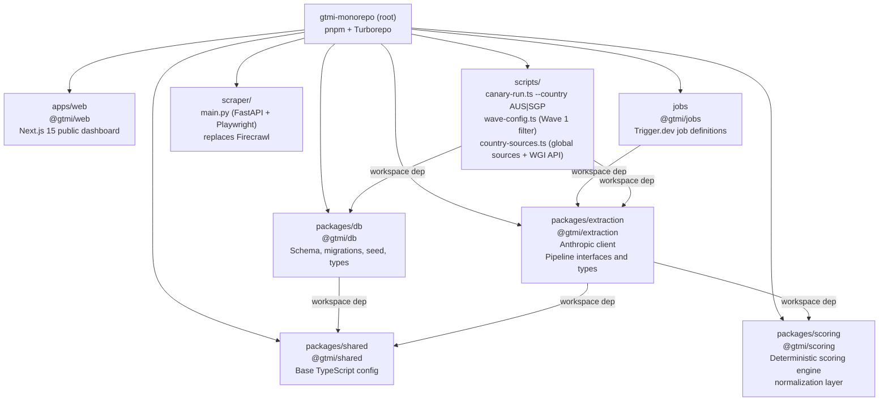
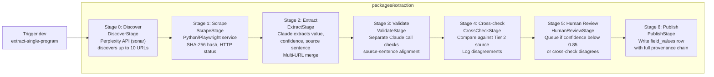
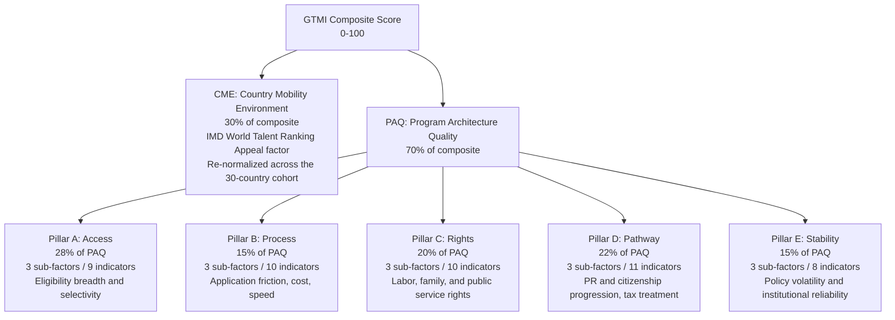

# GTMI Architecture Overview

> This document reflects what is implemented on `main` as of Session 8 (Phase 2 — AUS canary run complete, SGP pending). For the full product specification see [docs/BRIEF.md](BRIEF.md). For the scoring methodology see [docs/METHODOLOGY.md](METHODOLOGY.md).

> **Last updated:** Session 8 — 21 Apr 2026. Stage 0 switched to Perplexity API; Firecrawl replaced by Python/Playwright scraper service; E.3.2 World Bank API direct; cross-check bypassed in canary; extract rate-limit retry and delay improvements.

## 1. Overview

The Global Talent Mobility Index (GTMI) is a composite indicator platform that benchmarks talent-based premium mobility programs across 30 countries. It combines a 30% Country Mobility Environment (CME) score derived from IMD's published Appeal factor with a 70% Program Architecture Quality (PAQ) score built from 48 indicators across 5 pillars and 15 sub-factors, all sourced exclusively from government documents. Every published value is traceable to an exact sentence in a government source, with scrape timestamp, content hash, character offsets, and extraction model recorded. The index re-scrapes all Tier 1 sources weekly and surfaces policy changes as they occur.

## 2. Monorepo Layout

The repository is a pnpm workspace orchestrated with Turborepo. Six workspace packages are active.

| Workspace             | Responsibility                                                                                                                                                                                                                                                                                                                                                                                                                               |
| --------------------- | -------------------------------------------------------------------------------------------------------------------------------------------------------------------------------------------------------------------------------------------------------------------------------------------------------------------------------------------------------------------------------------------------------------------------------------------- |
| `apps/web`            | Public-facing Next.js 15 dashboard. Tailwind CSS v3 and shadcn/ui configured. No data fetching yet.                                                                                                                                                                                                                                                                                                                                          |
| `packages/db`         | Drizzle ORM schema and migrations for Supabase, seed scripts for all reference data, methodology v1 weights, and unit tests.                                                                                                                                                                                                                                                                                                                 |
| `packages/extraction` | Client factories for Anthropic. Typed interfaces for all 7 pipeline stages. Shared types for extraction inputs, outputs, and provenance records. `executeMulti` runs sequentially with 5s inter-scrape delay (increased from 2s). Extraction system prompt handles bullet lists, condition blocks, numbered requirement lists, table rows, and enforces strict per-field-type output format. Rate-limit retry: 3× with exponential back-off. |
| `packages/scoring`    | Deterministic scoring engine (`engine.ts`, `score.ts`, `normalize.ts`). `normalizeRawValue` normalization layer (`normalize-raw.ts`). 99 tests.                                                                                                                                                                                                                                                                                              |
| `packages/shared`     | Base tsconfig extended by all other packages. No runtime code.                                                                                                                                                                                                                                                                                                                                                                               |
| `jobs`                | Trigger.dev v3 job definitions. `extract-single-program` fully implemented end-to-end.                                                                                                                                                                                                                                                                                                                                                       |
| `scraper`             | Python FastAPI + Playwright microservice. Replaces Firecrawl. `main.py` exposes `POST /scrape` and `GET /health`. Start with `uvicorn main:app --host 0.0.0.0 --port 8765`. `SCRAPER_URL` env var (default `http://localhost:8765`).                                                                                                                                                                                                         |
| `scripts`             | `canary-run.ts` — full 7-stage pipeline runner; accepts `--country AUS\|SGP`; pre-fetches WGI score; bypasses LLM for E.3.2; cross-check hardcoded to `not_checked`. `wave-config.ts` — `WAVE_1_ENABLED` flag and `WAVE_1_FIELD_CODES` (27 sub-factor codes). `country-sources.ts` — `COUNTRY_LEVEL_SOURCES` registry (4 global sources), `getCountryLevelSources(fieldKey)`, `fetchWgiScore(iso3)`, `ISO3_TO_ISO2` mapping.                 |

## 3. Data Flow: 7-Stage Extraction Pipeline

The extraction pipeline is defined as TypeScript interfaces in `packages/extraction/src/types/pipeline.ts`. All 7 stage implementations are committed to `packages/extraction/src/stages/`. The Trigger.dev job `extract-single-program` runs the full pipeline end-to-end.

Stage 0 uses the **Perplexity API** (`sonar` model, `PERPLEXITY_API_KEY`). Stage 1 uses the **Python/Playwright scraper service** (`SCRAPER_URL`). Stages 2–4 and bulk summaries use `claude-sonnet-4-6`. Four Claude model constants are exported from `packages/extraction/src/clients/anthropic.ts`: `MODEL_EXTRACTION` (Stage 2), `MODEL_VALIDATION` (Stage 3), `MODEL_CROSSCHECK` (Stage 4), and `MODEL_SUMMARY`. `MODEL_DISCOVERY` is also defined but unused by `discover.ts`. Each constant is independently updatable.

**Wave 1 filter:** `scripts/wave-config.ts` restricts the pipeline to 27 of 48 fields when `WAVE_1_ENABLED = true`. Set to `false` to run all 48 fields.

**Two-phase discovery:** Before Stage 0 runs, `scripts/country-sources.ts` country-level sources are loaded and scraped once per country (Phase 1). Stage 0 then discovers program-specific URLs (Phase 2). Per-field in Stage 2, country-level scrapes supplement program-level scrapes. Stage 4 cross-check selects the Tier 2 URL by keyword match against the field label, falling back to global sources from `scripts/country-sources.ts` if no program-level Tier 2 URL matches.

## 4. Tech Stack

| Layer         | Technology                                                 | Notes                                                                                                 |
| ------------- | ---------------------------------------------------------- | ----------------------------------------------------------------------------------------------------- |
| Frontend      | Next.js 15, React 19, Tailwind CSS v3, shadcn/ui, Recharts | App Router, TypeScript strict mode                                                                    |
| Database      | Supabase (Postgres 15), Drizzle ORM                        | RLS on all 13 tables from day one                                                                     |
| URL Discovery | Perplexity API (`sonar`)                                   | `PERPLEXITY_API_KEY`; live web search for up to 10 URLs per program                                   |
| Scraping      | Python/Playwright microservice (`scraper/`)                | FastAPI + Playwright; start with `uvicorn main:app --host 0.0.0.0 --port 8765`; `SCRAPER_URL` env var |
| Extraction    | Anthropic API                                              | `claude-sonnet-4-6` extracts and validates; rate-limit retry (3×); 5s inter-scrape delay              |
| Jobs          | Trigger.dev v3                                             | Scheduled scraping and diff detection (Phase 2+)                                                      |
| Email         | Resend                                                     | Policy change alerts (Phase 5)                                                                        |
| Archival      | Wayback Machine Save Page Now API                          | Legal-defensible source snapshots (Phase 5)                                                           |
| Tooling       | pnpm workspaces, Turborepo, TypeScript strict              | Strict mode enforced across all packages                                                              |
| Deployment    | Vercel (web), Supabase cloud, Trigger.dev cloud            | Not yet configured                                                                                    |

## 5. Methodology Scoring Model

See [docs/METHODOLOGY.md](METHODOLOGY.md) for the authoritative breakdown of sub-factor weights, indicator weights, normalization choices, and rubrics. The diagram below reflects the top-level composite structure as encoded in `packages/db/src/seed/methodology-v1.ts`.

All weights sum to 1.0 at every level. The methodology version is stored in the `methodology_versions` table and carried on every `scores` and `field_values` row. Scores are not recomputed retroactively when the methodology changes; each scoring run carries its version ID.

## 6. Provenance and Data Integrity

### Source tiers

Indicators in Pillars A through D, and in E.1 and E.2, must be populated exclusively from Tier 1 sources. Pillar E.3 uses external indices by design and discloses this on the methodology page.

| Tier   | Sources                                                                             | Use                                                                 |
| ------ | ----------------------------------------------------------------------------------- | ------------------------------------------------------------------- |
| Tier 1 | Immigration authority, tax authority, ministry, official gazette, statistics bureau | Primary extraction for all PAQ indicators (Pillars A-D and E.1-E.2) |
| Tier 2 | Law firm commentary (Fragomen, KPMG, Envoy, Baker McKenzie)                         | Cross-check and program narrative context only                      |
| Tier 3 | IMI Daily, Henley newsroom, Expatica, Nomad Gate, general news                      | Policy change early-warning signals only                            |

### Fail-loud posture

The seed script (`packages/db/src/seed/index.ts`) throws immediately on any malformed row. There are no silent skips, no `skip_empty_lines` options, and no default values substituted for missing required fields. Clean CSVs are enforced at the source by `scripts/convert-assets.ts`, which asserts exact row counts after stripping trailing blank lines before writing.

Missing indicator data is not imputed. An absent indicator is excluded from its sub-factor calculation, and a square-root penalty is applied at the sub-factor level. Programs below 70% data coverage on any pillar are flagged "insufficient disclosure" and withheld from the public ranking.

## 7. Current State

### Implemented on main

- **Schema**: 13 tables via Drizzle ORM. 12 core tables per [docs/BRIEF.md](BRIEF.md) plus `newsSources`, added in migration `00002` to support Tier 3 news signal tracking. RLS policies on all tables; V1 uses a placeholder `authenticated` role (see [docs/decisions/001-rls-v1-placeholder-auth.md](decisions/001-rls-v1-placeholder-auth.md)).
- **Seed data**: 30 countries, 85 programs, 85 Tier 1 sources, 10 Tier 3 news sources, and 48 `field_definitions` rows with weights, normalization functions, and directions fully populated.
- **Methodology v1**: Pillar, sub-factor, and indicator weights encoded in `packages/db/src/seed/methodology-v1.ts` and unit-tested in `packages/db/src/seed/__tests__/methodology-v1.test.ts`. The test verifies that all weights sum to 1.0 at every level and that the indicator count is exactly 48.
- **Extraction package**: Factory function for Anthropic client. All 7 pipeline stage interfaces (`DiscoverStage`, `ScrapeStage`, `ExtractStage`, `ValidateStage`, `CrossCheckStage`, `HumanReviewStage`, `PublishStage`) plus the `ExtractionPipeline` aggregate interface. Stage 0 types include `DiscoveredUrl`, `DiscoveryResult`, `GeographicLevel`. Model constants: `MODEL_DISCOVERY` (defined, unused by `discover.ts`), `MODEL_EXTRACTION`, `MODEL_VALIDATION`, `MODEL_CROSSCHECK`. `ProvenanceRecord` and all supporting types are defined and exported.
- **Extraction prompts**: All 48 `extractionPromptMd` strings committed to `field_definitions.extraction_prompt_md` in the database. Each prompt includes a no-inference directive: values not explicitly stated in the source must be returned as an empty string.
- **CI pipeline**: GitHub Actions lint, typecheck, and migration dry-run checks green on main (Phase 1 close-out, Szabi).
- **Trigger.dev job**: `extract-single-program` connected to project `proj_wqkutxouuojvjdzsqopp`. Dev server running. `maxDuration: 900`, build config set.
- **Pipeline stage implementations**: All 7 stage implementations committed to `packages/extraction/src/stages/`. `discover.ts` calls **Perplexity API** (`sonar`, `PERPLEXITY_API_KEY`) — not Claude. `scrape.ts` calls **Python/Playwright service** at `SCRAPER_URL` — not Firecrawl. Tier 1 failures throw loudly; Tier 2/3 failures log and return empty. `executeMulti` runs Tier 1 scrapes sequentially with a 5000ms inter-scrape delay (increased from 2000ms) and returns the highest-confidence result. Rate-limit retry in `extract.ts`: 3 attempts on 429 with 60s×attempt back-off. `validate.ts`: early return on empty `valueRaw`. Both `extract.ts` and `validate.ts` use improved `stripJsonFences` that extracts first `{...}` JSON object when no code fences present. Discovery returns up to 10 URLs with official-listing-page-first priority. Extraction system prompt enforces strict per-field-type output format rules.
- **Scoring engine**: `packages/scoring` workspace created (`engine.ts`, `score.ts`, `normalize.ts`, `normalize-raw.ts`, `types.ts`, `index.ts`). Three normalization schemes (min-max, z-score, categorical rubric), missing data penalty `(present / total)^0.5`, insufficient-disclosure flagging at 70% per pillar. `normalizeRawValue` layer converts raw extracted strings to typed primitives (`number | string | boolean`) before DB write. 99 tests passing; byte-identical re-runs verified.
- **Database connection**: `packages/db/drizzle.config.ts` loads `DATABASE_URL` from `.env` at monorepo root via `dotenv`. Migrations can now be applied against the live Supabase database.
- **Web scaffold**: Next.js 15 with App Router, Tailwind CSS v3 pinned at 3.4.19, shadcn/ui `Button` component, and a placeholder home page.

- **Perplexity API for Stage 0**: `discover.ts` rewritten to call Perplexity API (`sonar`, `PERPLEXITY_API_KEY`) instead of Claude. Same five-category source mix and HEAD request verification. `MODEL_DISCOVERY` constant retained in `anthropic.ts` but unused.
- **Python/Playwright scraper service**: `scraper/` directory with `main.py` (FastAPI + Playwright), `requirements.txt`, `README.md`. Replaces Firecrawl. Must be started before pipeline: `uvicorn main:app --host 0.0.0.0 --port 8765`. `SCRAPER_URL` env var (default `http://localhost:8765`). Full browser rendering handles JS-heavy government pages.
- **Wave 1 field filter**: `scripts/wave-config.ts`; `WAVE_1_ENABLED = true`; `WAVE_1_FIELD_CODES` (27 sub-factor codes). Canary and Trigger.dev jobs both respect the flag. Rollback = one flag change.
- **Country-level source registry**: `scripts/country-sources.ts`; 4 global sources (World Bank WGI, OECD Migration Outlook, IMD World Talent Ranking, Migration Policy Institute); `getCountryLevelSources(fieldKey)` helper; `ISO3_TO_ISO2` lookup table; `fetchWgiScore(iso3)` and `fetchAllWgiScores(iso3s)` World Bank API helpers.
- **Two-phase discovery**: Country-level sources scraped once per country run (Phase 1); Stage 0 program-specific discovery runs per program (Phase 2). Country-level scrapes appended as supplementary inputs for relevant fields in Stage 2.
- **E.3.2 World Bank API direct**: Canary pre-fetches E.3.2 (Government Effectiveness) from World Bank API via `fetchWgiScore()` in Phase 1. Bypasses LLM extraction; `extractionModel: 'world-bank-api-direct'`; auto-approved at confidence 1.0.
- **Canary cross-check bypassed**: Stage 4 in `canary-run.ts` hardcoded to `not_checked` / `agrees: true`. All Tier 1 + global sources merged into `executeMulti` inputs; Trigger.dev job retains proper Tier 2 cross-check.
- **Per-field Tier 2 cross-check source selection (Trigger.dev job)**: Tier 2 URLs scored by keyword overlap with field label; best-matching URL used; global source fallback if no program-level Tier 2 URL matches the field.
- **`validate.ts` resilience**: Character-offset mismatch logs `console.warn` and returns a safe result; field enters human review queue. Early return on empty `valueRaw`: returns `isValid: false` / `validationConfidence: 1.0` without LLM call.
- **`publish.ts` currency sanitization**: Currency-formatted strings (e.g. `AUD3,210.00`) stripped to numeric before normalization. NaN guard issues `console.warn` and returns early.
- **`publish.ts` normalizeRawValue type fix**: `rawAsString` (string) passed instead of `_numericValue` (number); prevents runtime crash on `.replace()`/`.trim()`.
- **Stage 0 five-category source mix**: (1) official govt/intergovernmental (up to 5, Tier 1), (2) global institutional (Tier 1), (3) immigration law/advisory firms (Tier 2), (4) independent visa/residency research publishers (Tier 2), (5) specialist immigration news/intelligence (Tier 2). Explicit EXCLUSIONS block.
- **Canary script**: `scripts/canary-run.ts` accepts `--country AUS|SGP`; per-field 25s rate-limit delay (increased from 3s); per-field progress logging, error recovery, and summary table.
- **AUS canary run results**: 27/48 fields attempted (Wave 1); 14 extracted values; 13 no value (content truncation at 30K chars); 0 auto-approved (all queued for human review). Issues identified: content truncation for salary/education/stability fields; currency not yet preserved as ISO code + numeric pair.

### Stubbed or not yet implemented

- **Supabase Auth**: The database project exists; team authentication is not yet configured.
- **Human review dashboard**: Review queue logic is implemented; no UI exists yet.
- **SGP canary run**: `canary-run.ts --country SGP` is ready to execute; Singapore S Pass has not yet been run.
- **Currency preservation**: `publish.ts` currently strips currency code before normalization. Need to store ISO currency code alongside numeric value in provenance or a separate field before normalization.
- **Content window strategy**: 13 AUS Wave 1 fields returned no value due to content truncation at ~30K chars. Strategy for targeting sub-sections of large government pages not yet implemented.
- **Wayback Machine archival**: `scrape.ts` has a `// TODO` marker for Wayback Save Page Now API integration (Phase 5 scope).
